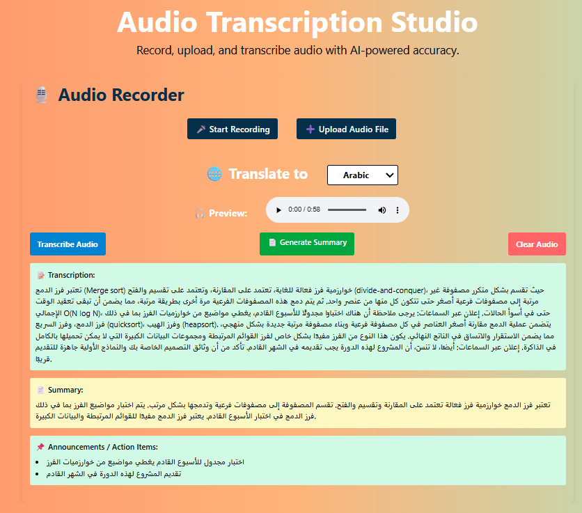

# Audio Transcription Studio

**Audio Transcription Studio** is a web-based application designed to **record, upload, transcribe, and summarize audio** using AI-powered tools. It offers a clean, responsive UI with features aimed at enhancing accessibility and productivity for users working with spoken content.

---

## 🔍 Key Features

### 🎙️ Audio Recorder
- Record audio directly from your device.
- Upload pre-recorded audio files (supports formats like `.mp3`, `.wav`, `.m4a`, etc.).
- Friendly interface with prominent buttons to start recording or upload files.

### 🌐 Translation Support
- Allows users to select a target language from a dropdown (e.g., Arabic).
- Displays transcribed audio in the selected language for localization purposes.

### ▶️ Audio Preview
- In-browser audio player to listen to the uploaded or recorded file.
- Real-time feedback before processing.

### 📝 Transcription
- AI generates a **detailed transcription** of the audio.
- Shown in a scrollable and clearly labeled section.
- Supports right-to-left (RTL) languages like Arabic.

### 📚 Summary Generation
- Users can click **"Generate Summary"** to receive a concise overview of the transcription content.
- Helps save time by condensing large audio files into key takeaways.

### 📢 Announcements / Action Items
- Summarizes important next steps, reminders, or highlights from the audio.
- Useful for meetings, lectures, and project planning.

---

## 💻 Tech Stack & Styling

- Built with **React + Tailwind CSS** for responsive, mobile-friendly design.
- UI features:
  - Gradient background with a soft, professional color palette.
  - Modular cards for transcription, summary, and announcements.
  - Buttons styled with hover transitions and clear call-to-actions.

---

## 📌 Use Cases

- Meeting recording and minutes summarization.
- Lecture or podcast transcription for study notes.
- Audio translation for multilingual teams.
- Accessibility support for hearing-impaired users.

---

## 🚀 Future Enhancements (Suggestions)
- Multi-language transcription and auto-detect language.
- Save/export functionality for transcripts and summaries.
- User authentication for saving session history.
- Integration with calendar or task apps for action items.

---
## 🔍 Image of the project

---

> Made using OpenAI and modern web tools.
